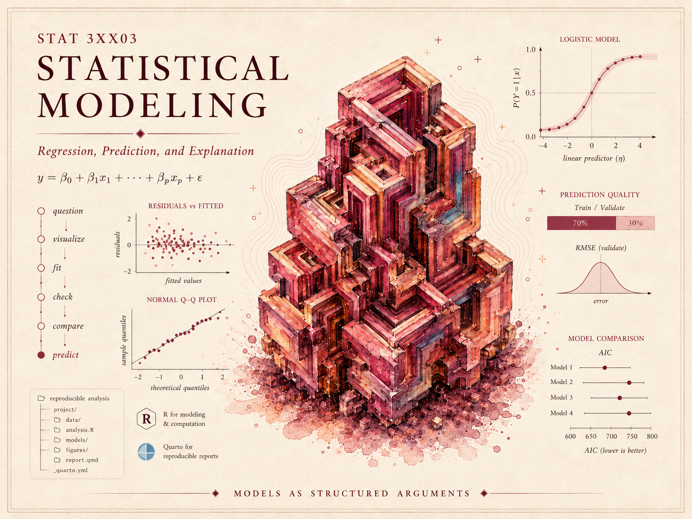

{.course-hero-img fig-alt="Course identity hero for Statistical Modeling — a crimson crystalline cube cluster surrounded by regression-modeling graphics including the linear model equation, a residuals-versus-fitted plot, a normal Q-Q plot, a logistic-regression curve, prediction-quality and RMSE panels, and an AIC model-comparison chart, with the course title."}

> A model is not just a line on a graph or a formula in a printout. It is a structured argument about how
> variables are related, what comparison is being made, how much uncertainty remains, and what the data can
> and cannot support. This course teaches you to build that argument carefully — to choose, fit, check,
> explain, and communicate statistical models responsibly.

## What this course is

This is a course in **statistical modeling** built around one idea: a model is a way of making *careful
claims from data*. We begin with statistical questions, data structure, visualization, and the logic of
regression. We then develop simple linear regression, learn to read and criticize regression output, add
multiple predictors and adjustment, and confront confounding head-on. From there we extend the same
modeling habits to categorical predictors and group comparisons, interactions and effect modification,
prediction and validation, logistic regression for binary outcomes, model comparison and selection, and the
connection between ANOVA and regression — finishing with reproducible modeling reports and a synthesis of
the whole arc.

The emphasis throughout is **interpretation, communication, and model criticism**. The goal is not to
memorize a list of procedures. It is to learn how to ask a clear question, fit a defensible model, check
whether that model is adequate for its purpose, and say honestly what the data support — limitations,
uncertainty, and possible bias included.

We use **R** and **Quarto** as modeling tools throughout. But this is a modeling course, not a programming
course: the software exists to fit, check, and communicate models, and every line of code is in service of
a statistical idea.

## What you will be able to do

By the end of the term, you should be able to:

- Identify the statistical question, the unit of observation, the response, the explanatory variables, and
  the comparison a model is making.
- Use graphs and summaries to prepare for modeling, rather than treating a model as the first step.
- Fit and interpret simple and multiple regression models in context — slopes, intercepts, fitted values,
  residuals, uncertainty, and fit.
- Explain adjustment and confounding, and the difference between a crude and an adjusted comparison.
- Use residual plots and other diagnostics to judge whether a model is adequate for a particular purpose.
- Interpret categorical predictors, interactions, and effect modification.
- Distinguish explanatory modeling from predictive modeling, and use validation to judge prediction and
  detect overfitting.
- Fit and interpret logistic regression for a binary outcome, and read odds ratios.
- Compare reasonable models without treating automatic selection as a substitute for judgment.
- Produce a reproducible modeling report and communicate model-based conclusions carefully.

## How the site is organized

This public site has three working areas, reachable from the sidebar:

- **Notes** — the weekly instructional spine. Each week poses a modeling question, develops the concept,
  fits and interprets a model on the recurring teaching dataset, names a common mistake, and offers ungraded
  self-checks. Start here.
- **Labs** — the hands-on modeling strand. Four short labs in R and Quarto let you fit, check, and validate
  models yourself. Code is shown for study; you run it in your own session.
- **Resources** — a notation glossary, a one-page modeling reference, and setup instructions for R and
  Quarto. Keep these open while you read.

## Software

We use **R** (via RStudio or Posit Cloud) together with **Quarto** to fit, check, and communicate models.
No prior coding experience is assumed — the modeling workflow is scaffolded, and the code is explained as it
goes. On this site, R chunks are **shown as static teaching code** and are not executed in place;
you run them in your own session.

## Source and attribution

These notes are the course's own synthesis, **grounded in but not copied from** two open textbooks:

- **Primary spine:** *Statistical Inference via Data Science: A ModernDive into R and the Tidyverse*, 2nd
  edition, by Chester Ismay, Albert Y. Kim, and Arturo Valdivia — free at
  [moderndive.com/v2](https://moderndive.com/v2/). **License: CC BY-NC-SA 4.0.** It grounds our scope and
  sequence for data visualization, data wrangling, regression, inference, and reproducible R/Quarto
  workflows.
- **Supplement:** *Beyond Multiple Linear Regression: Applied Generalized Linear Models and Multilevel
  Models in R* by Paul Roback and Julie Legler — free at
  [bookdown.org/roback/bookdown-BeyondMLR](https://bookdown.org/roback/bookdown-BeyondMLR/). **License: CC
  BY-NC-SA 4.0.** Used selectively for logistic regression and generalized models.

Both sources are licensed **CC BY-NC-SA 4.0** (Attribution · NonCommercial · ShareAlike). The course notes
are instructor-original and only *ground in* these texts; any public reuse or adaptation is treated
conservatively and transparently, with attribution. All example data are **synthetic with seeds set**; the
prose here is original.

## A note on what is public here

Everything on this site is **public and ungraded** — study material only. You will not find graded prompts,
answer keys, rubrics, point values, or due dates here. The operational side of the course — graded modeling
checkpoints, labs, quizzes, homework and modeling memos, the midterm, the project, and the final, along with
all dates and submissions — lives in **Blackboard (the LMS)**, which is authoritative. If this site and
Blackboard ever disagree, follow Blackboard.

::: {.callout-note}
## Draft course site

This site is a **draft course site**, not a finished release. Some pages are drafts, every
formula and fitted number is **synthetic and provisional pending human review**, and no
accessibility-compliance claim is made. Treat it as a work in progress rather than the final word.
:::
